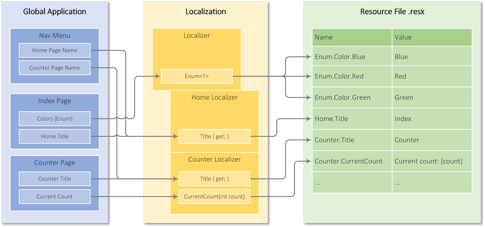
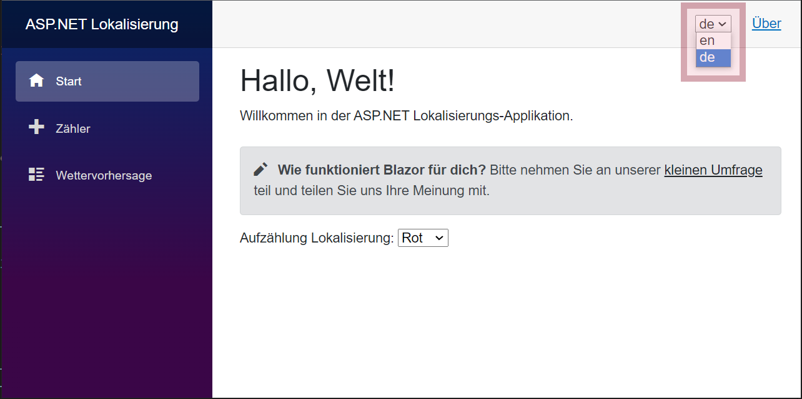

# Structured ASP.NET Localization

In the globally connected IT world, delivering software in different languages is a basic requirement. This article presents a structured approach to localizing ASP.NET applications using the Blazor template application.

Structuring localization provides the following benefits
- Localized text is grouped by topic
- Type safety for localization parameters
- Enumeration localization
- Clear translation templates

### From Global to Local
To localize an application, it must be designed to be as culturally neutral as a global application. Global applications are extended by the localization of the respective culture. This separation is achieved by placing the localized texts in [Resource Files](https://learn.microsoft.com/en-us/dotnet/api/system.resources.resourcemanager) of type `.resx`.

The following overview shows the localization of the sample application.
<p align="center">
    
</p>

Localization is represented in Visual Studio as follows:
- Localizations.csproj - Class library
  - LocalizerBase.cs - Base class for all localizers
  - Localizer.cs - Strater class for localization
  - Resources\Localizations.resx - English (default) localization resources
  - Resources\Localizations.de.resx - German localization resources
- GlobalApp.csproj - Blazor server application
  - Shared\\*.razor - Shared components
  - Pages\\*.razor - Application pages

### Building Localizers
All localized texts are divided thematically into localizer classes, which are derived from the base class `LocalizerBase`. The localized texts are accessed through the root class `Localizer`:
```csharp
public class Localizer : LocalizerBase
{
    public Localizer(IStringLocalizerFactory factory) :
        base(factory, nameof(Localizer))
    {
        App = new(factory);
        Home = new(factory);
        Survey = new(factory);
        Counter = new(factory);
        Forecast = new(factory);
    }

    public AppLocalizer App { get; }
    public HomeLocalizer Home { get; }
    public SurveyLocalizer Survey { get; }
    public CounterLocalizer Counter { get; }
    public ForecastLocalizer Forecast { get; }
}
```

For each topic, a localizer is implemented to provide access to the translated resources, like the example `CounterLocalizer`:
```csharp
public class CounterLocalizer : LocalizerBase
{
    public CounterLocalizer(IStringLocalizerFactory factory) :
        base(factory)
    {
    }

    public string Title => Localization();
    public string Click => Localization();
    public string CurrentCount(int currentCount) =>
        ApplyParameter(Localization(), nameof(currentCount), currentCount);
}
```

The fixed translation data is determined with the `Localization()` method. The translation keys `Counter.Title`, `Counter.Click` and `Counter.CurrentCount` are generated from the class name and the property. Translations with variable parameters generate a formatted text with the parameter name as placeholder `Current count: {currentCount}`.

### Setup Cultures
The `Culture` class manages the translation culture:
- Available languages
- Default language
- Access path to translation resources
- Getting and changing the runtime language

For ASP.NET applications, the structure is not set at the application level (`CultureInfo.CurrentCulture` and `CultureInfo.CurrentUICulture`), but at the web request thread level (`CultureInfo.DefaultThreadCurrentCulture` and `CultureInfo.DefaultThreadCurrentUICulture`).

### Providing the Localizer
The `Localizer` is accessed through dependency injection, which is set up when the application is launched.
```csharp
public class Program
{
    private static void SetupLocalization(IServiceCollection services)
    {
        services.AddLocalization(o => { o.ResourcesPath = Cultures.ResourcesPath; });
        services.AddTransient<Localizer>();
        Cultures.ApplyCulture();
    }

    public static void Main(string[] args)
    {
        var builder = WebApplication.CreateBuilder(args);

        // Add services to the container.
        builder.Services.AddRazorPages();
        builder.Services.AddServerSideBlazor();
        builder.Services.AddSingleton<WeatherForecastService>();

        // localizations
        SetupLocalization(builder.Services);

        var app = builder.Build();

        // app setup
        // ...

        app.Run();
    }
}
```

The `SetupLocalization` method performs the following steps

1. Register the [Microsoft Localization Extensions](https://learn.microsoft.com/en-us/dotnet/api/microsoft.extensions.localization)
2. Register the 'Localizer' in the DI
3. Set the default language for the current thread

### Using the Localizer
The `Localizer` is inserted into the page using `Inject` and replaces the hardcoded text with a readable property or method access.
```html
@page "/counter"
@using Localization

<PageTitle>Counter</PageTitle>

<h1>@Localizer?.Counter.Title</h1>

<p role="status">@Localizer?.Counter.CurrentCount(currentCount)</p>

<button class="btn btn-primary" @onclick="IncrementCount">@Localizer?.Counter.Click</button>

@code {
    private int currentCount;
    [Inject]
    private Localizer? Localizer { get; set; }

    private void IncrementCount()
    {
        currentCount++;
    }
}
```

The value `@Localizer?.Counter.Title` returns the localized title and `@Localizer?.Counter.CurrentCount(currentCount)` provides type safety (`int`).

### Localizing Enumerations
Another scenario is the translation of enumerations whose localization is stored according to the `Enum.<EnumTypeName>.<EnumValue>` convention. The localized enumerations can be queried with `Localizer.Enum<T>(T value)`.
```html
@page "/"
@using Localization

<PageTitle>@Localizer?.Home.Title</PageTitle>

<h1>@Localizer?.Home.Header</h1>

@Localizer?.Home.Welcome

<SurveyPrompt Title="@Localizer?.Home.SurveyTitle" />

@Localizer?.Home.EnumLocalization
<InputSelect @bind-Value="CurrentColor">
    @foreach (var value in Enum.GetValues(typeof(Color)))
    {
        <option>@Localizer?.Enum((Color)value)</option>
    }
</InputSelect>

@code {
    [Inject]
    private Localizer? Localizer { get; set; }
    private string? CurrentColor { get; set; }

    protected override Task OnInitializedAsync()
    {
        CurrentColor = Localizer?.Enum(Color.Red);
        return base.OnInitializedAsync();
    }
}
```

### Runtime Language Switching
Switching the language at runtime is done via the drop-down list in the header, which activates the language in the background via the `Culture` class:
<p align="center">
    
</p>

### Resource Translation
The localization project contains the localized texts (`Localizations.resx`) in the default language, usually English. When localizing this file into other languages, the following aspects should be considered
- If the translation is for a language or country
    Language: `de`
    Countries: `de-US` or `de-GB`
- All placeholders (`count` in the example above) must be included
- All resources need to be translated

> Tools like [ReSharper](https://www.jetbrains.com/help/resharper/Reference__Code_Inspections_RESX.html) are helpful in finding broken translation resources.
